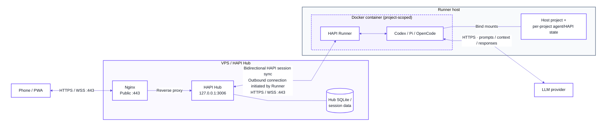

# agent-container

Run CLI coding agents in project-scoped Docker containers. Use upstream HAPI
for mobile chat, approvals, and conversation history.



Tools run locally; model context goes to the agent's configured provider.
Synced conversations stay on your VPS and remain available while the local
computer is offline. The container connects outward; no local inbound port is needed.

## Privacy contract

**Treat all data exposed to a container as potentially included in model context
sent to the selected LLM provider.**

This covers project files (including ignored files and Git history), mounted
credentials and conversations, shared configuration, forwarded environment
variables, and data available through reachable services. All agents in a
container share a user and can read each other's mounted state.

Keep private information outside this exposed set; use narrow project directories
and synthetic test data. Ignore files, agent instructions, and read-only mounts
do not prevent reading. There is no sensitive-file filter or upload gate.

Host networking, `SYS_PTRACE`, `seccomp=unconfined`, and passwordless sudo support
personal development. Host services remain reachable, and a shared HAPI token
provides access within the same Hub permission scope. This is not a hardened
sandbox for untrusted code.

## Quick start

Requires Linux, Bash and Docker accessible to your user. Deploy the Hub using
[the VPS guide](docs/operations.md#deploy), then from this repository:

```bash
mkdir -p ~/.local/bin
ln -s "$(pwd)/agent-container" ~/.local/bin/agent-container
# Add ~/.local/bin to PATH if needed. The project directory must exist.
agent-container --hapi ~/dev/myproj
```

The first run builds the image, asks for the HTTPS Hub URL and a hidden access
token, verifies them, and saves the URL/token in this project's HAPI state.
The VPS token is at `/etc/agent-hapi/hapi-access-token`. Already configured projects
reuse their settings. For unattended setup, pass an [env file](docs/agents.md#environment-files).

Success means Hub authentication and a round-trip Runner RPC both passed. Sign
in to that Hub on your phone and create sessions. **Configure the chosen agent's
provider before sending a prompt:** the launcher prints commands for Codex, Pi and
OpenCode. Follow [agent login and API keys](docs/agents.md); HAPI login alone does
not authenticate an agent or verify provider quota/model access.

## Use

| Command | Behavior |
| --- | --- |
| `agent-container <project>` | Interactive Bash; removes container on exit |
| `agent-container --persistent <project>` | Reuses interactive Bash container |
| `agent-container --hapi <project>` | Background HAPI Runner; first-run Hub setup and readiness check |
| `agent-container --rebuild <project>` | Rebuilds without cache, then replaces the project's container; combine with `--hapi` for a Runner |
| `--env-file <file>` | Explicit runtime environment for a new container; repeat for multiple files |

```bash
docker exec -it <container> bash  # Extra shell; Runner keeps running.
# In that shell: hapi codex, hapi pi, hapi opencode, or hapi resume.
docker stop <container>
agent-container --hapi <project>  # Restart and check after a stop or reboot.
```

Plain `codex` / `pi` / `opencode` runs without HAPI sync. There is no automatic
Runner restart policy. To change modes or environment, finish sessions and remove
the container first. Mounted files survive removal; installations in its writable
layer do not. `--rebuild` interrupts running tasks after the image build succeeds.

## State

| Data | Location |
| --- | --- |
| Project | Original directory at `/work/<project-name>` |
| Local agent/HAPI state | `~/.agent-container/projects/<path-hash>/{codex,opencode,pi,hapi}/` |
| Hub conversations | `/var/lib/agent-hapi/hapi/` on the VPS |

`AGENT_CONTAINER_DATA_DIR` overrides the local state root, which must not overlap
the project. `/`, the host home and its parents, and projects in `.ssh`/`.gnupg`
are rejected; other contents are your responsibility.

Every project receives a separate Codex home, including its native sessions and
runtime state. New projects seed only Codex `auth.json`, `config.toml`, and
`AGENTS.md` from `<state-root>/seed/codex/`, falling back to the state root. This
is an explicit one-time copy: the host `~/.codex` is not imported, existing
project state is not overwritten, and credentials are not live-shared between
containers. Choose model and reasoning effort per session in HAPI. See
[project state and trusted seed](docs/agents.md#project-state-and-trusted-seed)
for manual setup.

OpenCode and Pi link to that project's Codex instructions when none exist. Host
`.gitconfig` and `.tmux.conf` are mounted read-only when present; the host home,
full state root and Docker socket are not mounted automatically.

See [agent setup](docs/agents.md) and [operations](docs/operations.md) for
credentials, persistence, deployment, backups and connection troubleshooting.
