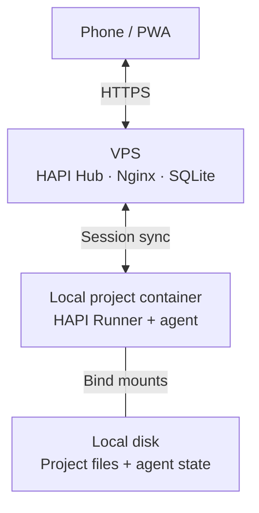

# codex-container

Run coding agents in local Docker containers and use a self-hosted HAPI PWA for
mobile chat, permission approvals, and conversation history. Project files stay
on your computer; synced conversations are stored on your VPS.



The container initiates the connection to the VPS; no inbound local port is needed.
An online Runner lets you create and resume supported agent sessions from your
phone. Synced history remains available when your computer is offline.

## Quick start

You need Linux, Bash, Docker, and permission to run Docker as your current user.
Install the Hub on your VPS using the [deployment guide](docs/operations.md),
then run these commands from this repository:

```bash
mkdir -p ~/.local/bin
ln -s "$(pwd)/codex-container" ~/.local/bin/codex-container
# Ensure ~/.local/bin is on PATH.
export HAPI_API_URL=https://hapi.example.com
codex-container ~/dev/myproj
```

The project directory must already exist. The first launch builds the image;
subsequent launches reuse it. Set up credentials inside the container:

```bash
hapi auth login  # Enter the HAPI access token from your VPS.
codex login     # If Codex credentials are not already configured.
hapi codex      # Work in the terminal and sync the session to HAPI.
```

Open the same Hub URL on your phone and sign in with the access token. Running
`codex` directly does not sync its session to HAPI. To create sessions from your
phone, exit the temporary interactive container, then run locally:

```bash
codex-container --hapi ~/dev/myproj
```

Once the Runner appears online in the PWA, select its machine and agent. A
successful launcher exit means Docker accepted the start request; check the PWA
or `docker logs <container-name>` to confirm the Runner is ready.

## Launch modes

| Command | Main process | Container lifetime |
| --- | --- | --- |
| `codex-container <project>` | Interactive Bash | Removed when Bash exits |
| `codex-container --persistent <project>` | Reusable interactive Bash | Stops when Bash exits; keeps its writable layer |
| `codex-container --hapi <project>` | Background HAPI Runner | Continues after the launching terminal closes |

`--hapi` runs the Runner as the container's main process, independently of the
launching terminal. **There is no automatic restart policy:** run `--hapi` again
locally after a Runner crash or computer restart. `--persistent` alone does not
start a Runner.

The launcher prints the container name, state directory, and image name.
Use Docker for local container management:

```bash
docker logs <container-name>
docker exec -it <container-name> bash
docker stop <container-name>
codex-container --hapi ~/dev/myproj  # Restart the same Runner container.
```

To change a container's startup mode, stop it and run `docker rm <container-name>`
first. `--rebuild` builds without cache, then replaces
the project's container if the build succeeds, interrupting any running tasks.
Removing or replacing a container preserves mounted project files and state.

## Work locally in a Runner container

You can open a shell in a running `--hapi` container without changing its startup
mode or stopping the Runner:

```bash
docker exec -it <container-name> bash
hapi codex  # Inside the container: start a new session synced to the same Hub.
```

The new session and its messages appear in the PWA. Use `hapi resume` inside the
container to select an existing session instead. Running plain `codex` does not
automatically sync it to HAPI.

Exiting this extra shell leaves the Runner running. A locally started Codex
session ends when its terminal exits; its synced history stays on the VPS and
can be resumed later.

## Data and shared configuration

| Data | Storage |
| --- | --- |
| Project files | Original local directory, mounted at `/work/<project-name>` |
| Agent configuration, credentials, and native resume state | `~/.codex-container/projects/<path-hash>/{codex,opencode,pi}/` |
| HAPI credentials and machine identity | The same project's `hapi/` directory |
| Synced conversations and messages | `/var/lib/codex-hapi/hapi/` on the VPS |
| Other container files and temporary software installations | Container writable layer; lost when the container is removed |

Each project mounts only its own state. Set `CODEX_CONTAINER_DATA_DIR` to change
the state root, which must be outside the project directory. New projects copy
`auth.json`, `config.toml`, and `AGENTS.md` from `~/.codex-container/seed/codex/`,
falling back to files with the same names in the legacy state root. Seeding runs
once and never overwrites an existing project. Copy any additional files
referenced by your configuration into that project's `codex/` directory.

Host `.gitconfig` and `.tmux.conf` files are mounted read-only when present. The
project's Codex `AGENTS.md` is linked for OpenCode and Pi in the same project.
The host home directory, entire state root, and Docker socket are not mounted.
VPS history does not replace native agent resume state; back up both separately.

## Scope

- Manage containers locally. Remote container creation, start/stop controls, and
  a separate project management page are outside the current scope.
- Use upstream HAPI without source patches or a custom control service.
- The image includes Codex, OpenCode, Pi, and HAPI `0.30.7`. Codex is the main
  verified path. Use `hapi opencode` or `hapi pi` for the other installed agents
  after configuring their model credentials. DSH is not installed or verified;
  Z.ai ZCode is not integrated. See the [pinned HAPI support matrix](https://github.com/tiann/hapi/blob/0239edf38e2da653d662f31039e24ccea04c7837/docs/guide/agents.md).

The container retains host networking, `SYS_PTRACE`, `seccomp=unconfined`, and
passwordless sudo for personal development. This is not strict isolation from a
malicious agent: host network services remain reachable, and a shared HAPI
access token grants access within the same Hub permission scope.

See the [operations guide](docs/operations.md) for deployment, upgrades, backups,
proxy troubleshooting, and verification details.
