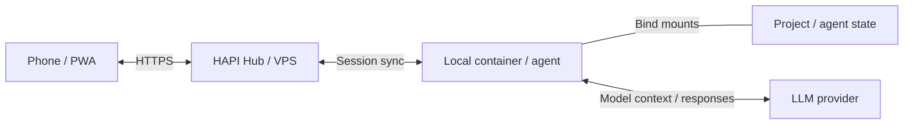

# agent-container

Run CLI coding agents in project-scoped Docker containers. Use upstream HAPI
for mobile chat, approvals, and conversation history, without a custom control
service or HAPI patches.



Tools run locally; model context goes to the agent's configured provider.
Synced conversations stay on your VPS and remain available while the local
computer is offline. The container connects outward; no local inbound port is needed.

## Privacy contract

**Treat all data exposed to a container as potentially included in model context
sent to the selected LLM provider.**

This covers project files (including ignored files and Git history), mounted
credentials and conversations, shared configuration, forwarded environment
variables, and data available through reachable services. All agents in a
container share a user and can read each other's mounted state.

Keep private information outside this exposed set; use narrow project directories
and synthetic test data. Ignore files, agent instructions, and read-only mounts
do not prevent reading. There is no sensitive-file filter or upload gate.

Host networking, `SYS_PTRACE`, `seccomp=unconfined`, and passwordless sudo support
personal development. Host services remain reachable, and a shared HAPI token
provides access within the same Hub permission scope. This is not a hardened
sandbox for untrusted code.

## Quick start

Requires Linux, Bash, and Docker accessible to your user. Set up the Hub using
[the deployment guide](docs/operations.md), then install the launcher:

```bash
mkdir -p ~/.local/bin
ln -s "$(pwd)/agent-container" ~/.local/bin/agent-container
# Add ~/.local/bin to PATH if needed.
export HAPI_API_URL=https://hapi.example.com
agent-container ~/dev/myproj
```

The project must exist. The first launch builds the image. Inside the container:

```bash
hapi auth login  # Use the Hub access token.
codex login     # If credentials are not already configured.
hapi codex      # Start a session synced to the Hub.
```

Sign in to the same Hub URL on your phone. Plain `codex` runs without HAPI sync.
The image also includes OpenCode and Pi; configure their credentials before
using `hapi opencode` or `hapi pi`. Codex is the verified integration; consult
[HAPI's pinned support matrix](https://github.com/tiann/hapi/blob/0239edf38e2da653d662f31039e24ccea04c7837/docs/guide/agents.md)
for each agent's permissions and resume support.

## Launch modes

| Command | Behavior |
| --- | --- |
| `agent-container <project>` | Interactive Bash; removes container on exit |
| `agent-container --persistent <project>` | Reuses interactive Bash container; retains its writable layer |
| `agent-container --hapi <project>` | Background HAPI Runner; supports session creation from the PWA |
| `agent-container --rebuild <project>` | Builds without cache, then replaces this project's container |

After configuring HAPI, exit the interactive container before starting `--hapi`.
A successful launch means Docker accepted the request; check Runner readiness:

```bash
docker logs <container-name>
docker exec -it <container-name> bash  # Extra shell; Runner keeps running.
# In that shell: hapi codex for a new synced session, hapi resume to resume one.
docker stop <container-name>
agent-container --hapi <project>      # Restart after a crash or computer reboot.
```

There is no automatic Runner restart policy. To change startup modes, stop and
remove the container first. `--rebuild` interrupts running tasks after a successful
build. Container removal preserves mounted files and state; other installations
in its writable layer are lost. Exiting an extra shell leaves the Runner running,
but a session attached to that terminal ends; its synced history remains available.

## State and configuration

| Data | Location |
| --- | --- |
| Project | Original directory mounted at `/work/<project-name>` |
| Agent and HAPI state | `~/.agent-container/projects/<path-hash>/{codex,opencode,pi,hapi}/` |
| Hub conversations | `/var/lib/agent-hapi/hapi/` on the VPS |

Set `AGENT_CONTAINER_DATA_DIR` to override the local state root. It must not overlap
the project. The launcher rejects `/`, the host home and its parents, and projects
inside the host's `.ssh` or `.gnupg`; other directory contents are your responsibility.

New projects seed only `auth.json`, `config.toml`, and `AGENTS.md` from
`<state-root>/seed/codex/`, falling back to the state root. Existing files are never
overwritten. Copy other referenced configuration files into the project's state.
OpenCode and Pi link to that project's Codex `AGENTS.md` when no instructions exist.
Host `.gitconfig` and `.tmux.conf` are mounted read-only when present; the host home,
full state root, and Docker socket are not automatically mounted.

See [operations](docs/operations.md) for upgrades, backups, troubleshooting,
verification, and migration from `codex-container`.
